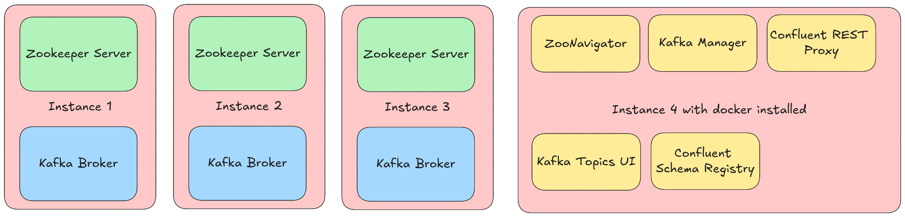

# Kafka Introduction

Apache Kafka is a distributed streaming platform that is used publish and subscribe to streams of records. It is designed to be fault-tolerant and scalable. Kafka is used for building real-time data pipelines and streaming applications. It is horizontally scalable, fault-tolerant, and fast.

> [!Tip]
> So, What is Kafka?

Kafka is a distributed streaming platform that is used to publish and subscribe to streams of records. It is designed to be fault-tolerant and scalable. Kafka is used for building real-time data pipelines and streaming applications. It is horizontally scalable, fault-tolerant, and fast.

Here, we will discuss the following topics:

- [Kafka Architecture](#kafka-architecture)
- [Kafka Components](#kafka-components)
- [Kafka Topics](#kafka-topics)
- [Kafka Producers](#kafka-producers)
- [Kafka Consumers](#kafka-consumers)
- [Kafka Brokers](#kafka-brokers)
- [Kafka Zookeeper](#kafka-zookeeper)
- [Kafka Cluster](#kafka-cluster)
- [Kafka Manager](#kafka-manager)
- [Confluentic Schema Registry](#confluent-schema-registry)
- [Kafka Topics UI](#kafka-topics-ui)

## Kafka Architecture

Our finished architecture will look like this:

## Kafka Components

## Kafka Topics

## Kafka Producers

## Kafka Consumers

## Kafka Brokers

## Kafka Zookeeper

## Kafka Cluster

## Kafka Manager

## Confluent Schema Registry

## Kafka Topics UI

## Conclusion
