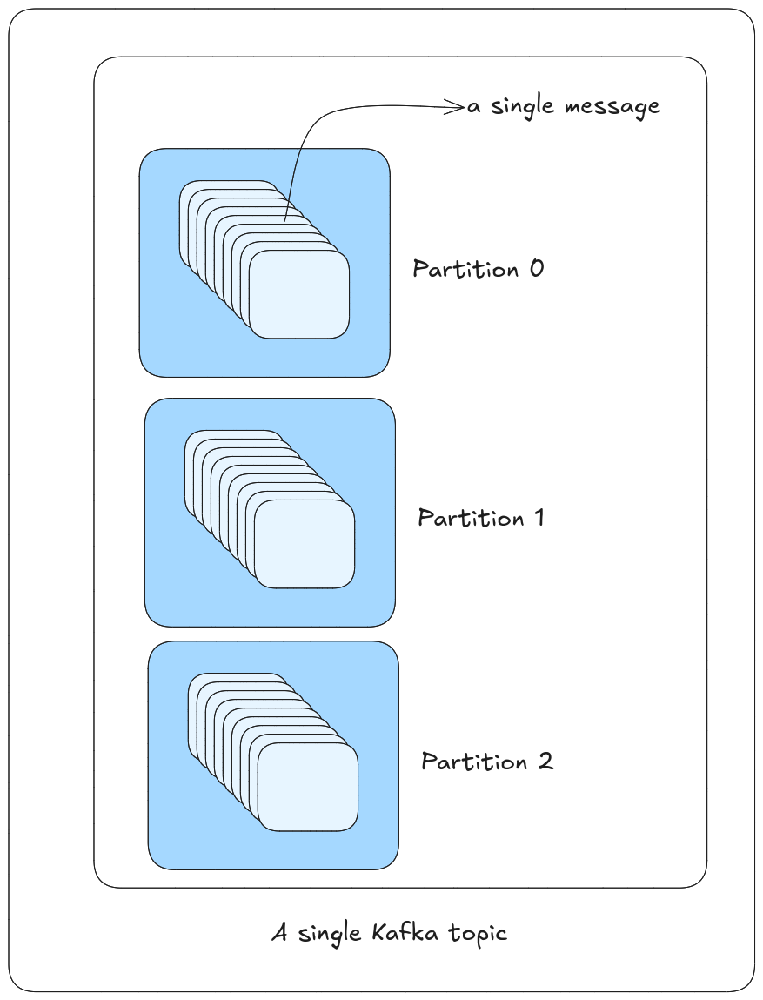

# Kafka Topics

Kafka's fundamental unit of organizing and storing event is topic. As a developer we create topics to store events. Different type of events are stored in different topics. A topic is a category or feed name to which records are published. Some of us may call the topic as a queue. But, it is not a queue. First reason not to call a kafka topic as a queue is that, queue is highly structured and kafka topic is not. Second reason is that, in a queue, a message is consumed by only one consumer. But in kafka, a message can be consumed by multiple consumers. So, a topic can be thought of as a feed or log. A topic is a category or feed name to which records are published.

Another thing about topic is, they are immutable and durable. Once a record is published to a topic, it cannot be changed. It is immutable. And, once a record is published to a topic, it is stored in the topic for a configurable amount of time. This is called **retention period**. The default retention period is **7 days**. After 7 days, the record is deleted from the topic. But, we can configure the retention period to be infinite. This means that the record will never be deleted from the topic. This will obviously lead to disk space issues. So, we need to be careful while configuring the retention period.

> [!Tip]
> Topics are always multi-subscriber; that is, a topic can have zero, one, or many consumers that subscribe to the data written to it.

## Topic Partitions

As kafka is designed to function as a distributed system, it makes sense to divide the topics into different partitions.

> [!Warning]
> So what is the problem if there was no partition?

The problem is that, if there was no partition, then the topic would be stored in a single broker (node or a computer). This would lead to a single point of failure. If the broker goes down, then the topic is lost. So, to avoid this, we divide the topic into partitions.

A partition is a unit of parallelism. A topic can have multiple partitions. Each partition is an ordered, immutable sequence of records that is continually appended to a structured commit log. Each record in a partition is assigned a unique sequential id number called the offset that uniquely identifies each record within the partition.

So, partition can be thought of mulltiple channels of a single topic that lives in different brokers. This way, if one broker goes down, the other brokers can still serve the topic.

> [!Important]
> So, how does kafka decide which partition to write to when a record is published to a topic?

Kafka uses a partitioner to decide which partition to write to when a record is published to a topic. The default partitioner is the **round-robin** partitioner.

So, there can be 2 scenarios:

1. If the key is present in the record, then the partitioner uses the key to decide which partition to write to. This is called **key-based partitioning**. Basically, key passes through the hash function and the hash function decides which partition to write to. This way, all records with the same key are written to the same partition. This ensures that the order of the records is maintained. This is important when the order of the records is important. This is called **ordering guarantee**.

1. If the key is not present in the record, then the partitioner uses the **round-robin** partitioner to decide which partition to write to. This is called **round-robin partitioning**. In this case, the order of the records is not maintained.

## Partition Replication

> [!Warning]
> Why do we need partition replication?

As discussed earlier, kafka is a distributed system. So, it would become a single point of failure if the partition is stored in a single [broker](./README.md#kafka-brokers). So, to avoid this, we replicate the partition in different brokers. This is called **partition replication**.

Basically a partition is replicated in multiple brokers. One of them is a leader and the others are followers. The leader is the broker that is responsible for all read and write requests for the partition. The followers are the brokers that replicate the partition from the leader. If the leader goes down, then one of the followers becomes the leader. This is called **leader election**.

> [!Note]
> In general we don't need to worry about the leader and the followers. Kafka takes care of this for us. We only need to know that the partition is replicated in multiple brokers.

**Replication Factor:** The replication factor is the number of brokers in which the partition is replicated.

> [!Tip]
> The replication factor is tunable on the Producer Side.
> The default replication factor is 1. This means that the partition is stored in only one broker. If the broker goes down, then the partition is lost. So, we can increase the replication factor to 2 or 3. This means that the partition is stored in 2 or 3 brokers. This way, if one broker goes down, the other brokers can still serve the partition.
