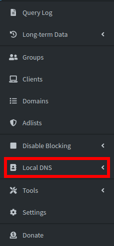

# How to add a DNS record to Pi-hole

[Pi-hole](https://pi-hole.net/) is a network-wide ad blocker that improves your internet experience by blocking ads, trackers, and malware. It is designed to run on a Raspberry Pi, but it can also be installed on other devices, such as a Linux server or a virtual machine. Pi-hole uses [dnsmasq](http://www.thekelleys.org.uk/dnsmasq/doc.html) as its DNS server, which allows you to add custom DNS records to your Pi-hole installation. With custom DNS records, you can resolve domain names to specific IP addresses, override public DNS records, and create local DNS records for your private network.

In this guide, you will learn how to add a DNS record to Pi-hole using the web interface.

## Prerequisites

- A system running Pi-hole. If you don't have Pi-hole installed, you can follow our guide on [how to install Pi-hole on Ubuntu with Docker](./install-pihole.md).

## Adding a DNS record to Pi-hole

To add a DNS record to Pi-hole, follow these steps:

1. Open a web browser and navigate to `http://<pi-hole-ip>/admin`, where `<pi-hole-ip>` is the IP address of your Pi-hole server.

1. Log in to the Pi-hole web interface using your admin credentials.

1. Click on **Local DNS** in the left-hand menu.

    

1. Scroll down to the **DNS records** section and click on **Add a new domain**. Be sure to select a fake domain name that is not in use on the internet, such as `local` or `lan`. if you use a say `.com` domain, you will not be able to access the real domain from your local network.

1. Enter the domain name and the IP address of the device you want to resolve, then click **Add**.

## Conclusion

You have learned how to add a DNS record to Pi-hole using the web interface. With custom DNS records, you can resolve domain names to specific IP addresses, override public DNS records, and create local DNS records for your private network. This can be useful for accessing local services, such as a web server, a file server, or a media server, using a domain name instead of an IP address.